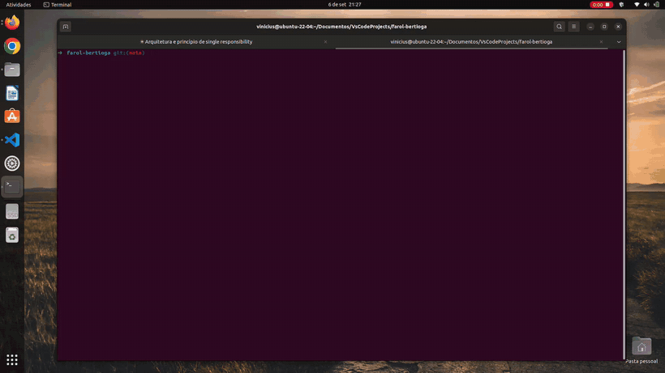
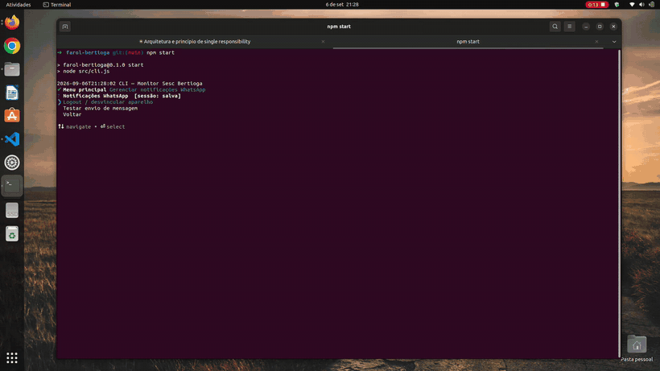
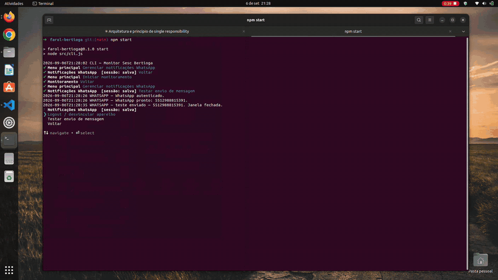
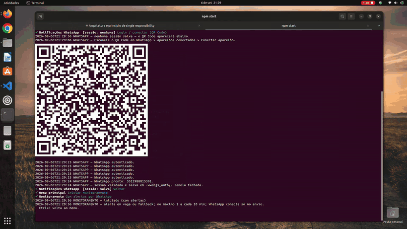

# Monitor de reservas — Sesc Bertioga

Monitor não oficial de disponibilidade de reservas do **Centro de Férias Sesc Bertioga**.
O portal oficial não avisa quando abrem vagas; este projeto automatiza o navegador para
consultar o portal a cada minuto e, futuramente, alertar por WhatsApp um grupo pequeno
de contatos.

> ⚠️ Projeto pessoal, sem vínculo com o Sesc. Use com as suas próprias credenciais e
> respeite os termos de uso do portal.

## Demonstração

### 1. Navegação pela CLI

`npm start` abre o menu interativo. As setas percorrem as opções e o Enter
confirma. É o ponto de entrada que roteia cada escolha para o serviço
correspondente (monitoramento ou gerenciamento de notificações).



### 2. Notificação de teste (WhatsApp)

Pelo menu "Gerenciar notificações WhatsApp" é possível enviar uma mensagem de
teste. O app conecta ao WhatsApp Web (`connect → ação → destroy`), dispara a
mensagem para os destinatários configurados e encerra a sessão do navegador.



### 3. Login com QR Code do WhatsApp

Na primeira conexão o WhatsApp Web exibe o QR Code no Chromium. Após escanear
com o celular, a autenticação fica salva em `.wwebjs_auth/` e as próximas
execuções não pedem o QR novamente.



### 4. Monitoramento em execução

O monitor abre o portal do Sesc, faz login e consulta a disponibilidade em
loop. Cada iteração imprime uma linha com timestamp e status em CAIXA ALTA;
uma resposta inesperada dispara alerta por WhatsApp (no máximo 1 a cada 10 min).



## Requisitos

- Node.js >= 20 (testado no v24)
- Chromium do Playwright (instalado por comando, abaixo)

## Instalação

```bash
npm install
npx playwright install chromium
```

## Configuração

Copie `.env.example` para `.env` e preencha:

| Variável | Descrição |
| --- | --- |
| `LOGIN` | E-mail/usuário do portal de reservas |
| `SENHA` | Senha do portal |
| `HEADLESS` | `false` (padrão) mostra o Chromium; `true` roda oculto |
| `WHATSAPP_SENDER` | Número que envia os alertas (só dígitos, com DDI). Conectado por QR Code |
| `WHATSAPP_RECIPIENTS` | Array JSON de números que recebem alertas, ex.: `["5511999999999"]` |
| `WHATSAPP_HEADLESS` | `false` (padrão) abre o WhatsApp Web no Chromium com o QR Code visível |

O `.env` real é ignorado pelo Git. Detalhes em [`docs/CONFIGURACAO.md`](docs/CONFIGURACAO.md).

## Uso

```bash
npm start   # CLI com menu interativo — a forma normal de usar
```

O menu cobre:

- **Iniciar monitoramento** — com ou sem alertas por WhatsApp (Ctrl+C volta ao menu).
  No modo com alertas, um *checkbox* deixa escolher os **meses de interesse** (do mês
  atual até 3 à frente; nenhum marcado = todos). Uma mensagem é enviada quando o portal
  abre uma vaga real num mês de interesse **ou** responde de forma inesperada, no máximo
  **1 a cada 10 minutos**.
- **Gerenciar notificações WhatsApp** — login (QR Code) / logout e teste de envio.

> A vaga é reconhecida de forma indireta: o mês precisa aparecer em "Meses disponíveis"
> **e** abrir o passo "Períodos" com `Disponíveis (N ≥ 1)`. Mês listado com
> `Disponíveis (0)` é só logado (`MÊS SEM PERÍODO`), sem WhatsApp. Ver `KNOWN_ISSUES.md`.

### Scripts diretos (sem menu)

```bash
npm run login          # uma consulta única, com o Chromium visível
npm run monitor        # repete a consulta a cada minuto (Ctrl+C para parar)
npm run whatsapp:test  # conecta o WhatsApp e envia uma mensagem de teste
```

### Como ler a saída

O monitor imprime linhas com timestamp (fuso de São Paulo) e um status em CAIXA ALTA:

- `VAGA NÃO DISPONÍVEL` — o portal mostrou `Nenhum mês aberto`.
- `MÊS SEM PERÍODO` — o mês aparece em "Meses disponíveis", mas o passo "Períodos" está
  em `Disponíveis (0)`. Não há vaga; **não** dispara WhatsApp.
- `VAGA DISPONÍVEL` — um mês abriu o passo "Períodos" com `Disponíveis (N ≥ 1)`. Dispara
  o alerta por WhatsApp (se o mês estiver entre os de interesse).
- `FALLBACK: ...` — qualquer resposta inesperada ou falha controlada. **Não é** um
  sinal de vaga; existe para evitar falso positivo.

## Documentação

- [`docs/ARQUITETURA.md`](docs/ARQUITETURA.md) — como as peças se encaixam
- [`docs/CONFIGURACAO.md`](docs/CONFIGURACAO.md) — variáveis de ambiente e sessões
- [`KNOWN_ISSUES.md`](KNOWN_ISSUES.md) — limitações e pendências
- [`CONTRIBUTING.md`](CONTRIBUTING.md) — como mexer no código

## Licença

[MIT](LICENSE)
