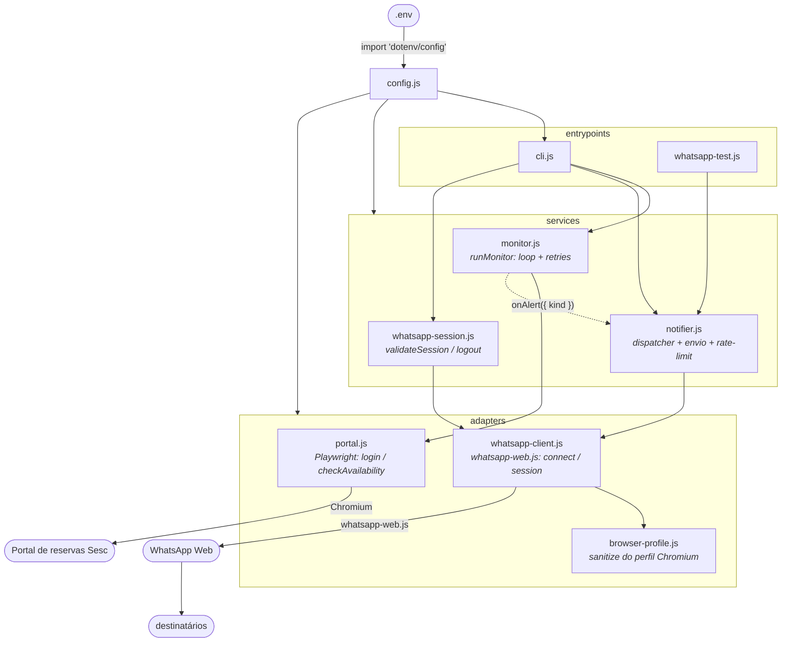
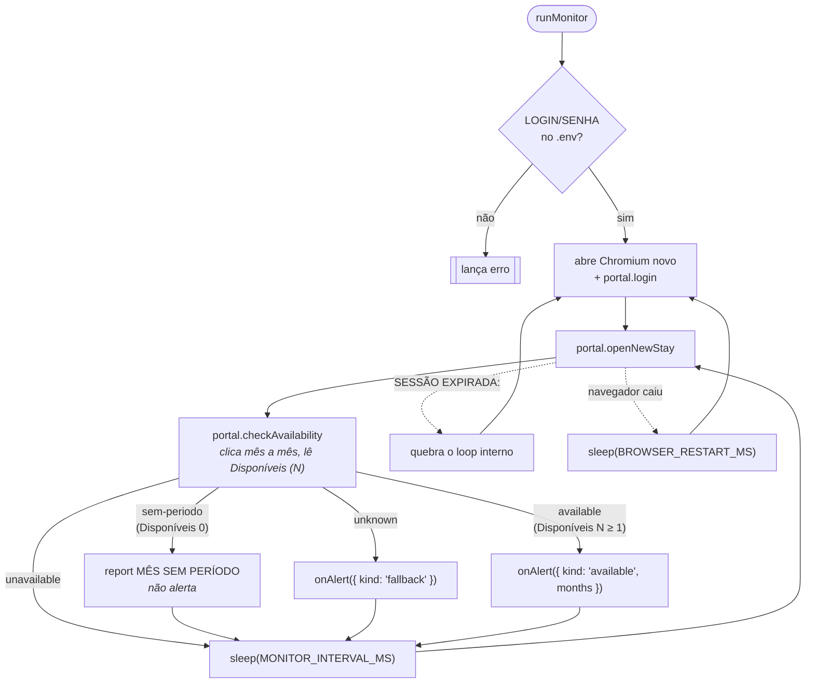

# Arquitetura

## Visão geral

Três camadas, de baixo para cima:

| Camada | Módulos | Responsabilidade |
| --- | --- | --- |
| **Base** | `config.js`, `logger.js` | Configuração e formato de log. Sem dependência interna. |
| **Adapters** | `adapters/portal.js`, `adapters/whatsapp-client.js`, `adapters/browser-profile.js` | Falam uma lib/protocolo (Playwright, whatsapp-web.js, perfil do Chromium). Sem regra de negócio. |
| **Services** | `services/monitor.js`, `services/notifier.js`, `services/whatsapp-session.js` | Regra e orquestração. Não sabem se foram chamados da CLI ou de um script. |
| **Entrypoints** | `cli.js`, `whatsapp-test.js`, guard de `services/monitor.js` | Carregam o `.env`, montam o fluxo, tratam `Ctrl+C`. Só fiação. |

`runMonitor` (loop) usa `adapters/portal.js` e chama `onAlert({ kind, months })` em vaga
(`'available'`) e `onAlert({ kind: 'fallback' })` em resposta inesperada; o dispatcher de
`notifier.js` envia por WhatsApp com limite de 1 a cada 10 min e filtra pelos meses de
interesse escolhidos no menu. Mês listado sem período (`'sem-periodo'`) só é logado. A
regra positiva de vaga (`Disponíveis (N ≥ 1)`) existe mas ainda não foi vista com vaga
real (ver `KNOWN_ISSUES.md`). Todos os módulos logam pelo `report(status, details)` de
`logger.js`.

**Regra de dependência:** entrypoints → services → adapters → base. Um adapter nunca
importa um service; um service nunca lê `process.env` (só `config.js` lê).

## `config.js`

Ponto único de configuração. **Nenhum outro módulo lê `process.env`.** Não carrega o
`.env` — cada entrypoint faz `import 'dotenv/config'` no topo, antes dos imports que
puxam `config.js`. Expõe:

- Constantes do portal: `PORTAL_URL`, `MONITOR_INTERVAL_MS`, `BROWSER_RESTART_MS`,
  `PORTAL_HEADED`.
- `portalCredentials()` → `{ login, senha }`; lança se faltarem `LOGIN`/`SENHA`.
- Constantes/paths do WhatsApp: `WHATSAPP_CLIENT_ID`, `WHATSAPP_AUTH_DIR`,
  `WHATSAPP_CACHE_DIR`, `WHATSAPP_PROFILE_DIR`, `WHATSAPP_HEADLESS`.
- Getters lidos a cada uso (para o teste sobrescrever): `whatsAppAckTimeoutMs()`,
  `whatsAppSettleMs()`, `whatsAppSender()`.
- `normalizeNumber(n)` e `whatsAppRecipients()` — parsing/validação de números.
- `numberFromEnv(name, fallback)` — helper de env numérico não-negativo.
- Meses do portal (puros): `PORTAL_MONTHS`, `monthLabel(ano, i)`,
  `upcomingMonthLabels(ahead, now)` (opções do menu), `normalizeMonthLabel(l)`
  (comparação) e `canonicalMonthLabel(raw)` (`"SETEMBRO / 2026"` → `"Setembro / 2026"`).

## `logger.js`

`timestamp()` (fuso `America/Sao_Paulo`, `sv-SE` → ISO-like) e
`report(status, details)` — o formato de log usado por todos os módulos.

## `adapters/portal.js`

Driver do portal — a única parte acoplada ao HTML do site. Sem estado; recebe a `page`
do Playwright e um `report` (default `logger.report`).

- **`login(page, report)`**: lê `portalCredentials()`, navega até `PORTAL_URL`, espera o
  iframe liberar o formulário (`waitForLoginContext`, até 90s varrendo `page.frames()`),
  preenche `#logEmail` / `#logPassword`, **pausa 1s** (sem isso o AngularJS do portal
  dispara o submit nativo — GET com a senha na URL — sem autenticar) e clica em
  `#btnLogin`. Confere se o formulário sumiu; se continuar, refaz o login (até 3×).
- **`openNewStay(page, report)`**: recarrega a tela de reservas (o portal só libera os
  recursos após reload) e procura "Nova hospedagem", tentando até 4× (~30s) para dar
  tempo ao cookie de SSO. Se nunca aparecer, lança `SESSÃO EXPIRADA:` — o loop de
  `monitor.js` quebra para reautenticar.
- **`checkAvailability(page, report)`** → `{ status, availableMonths, listedMonths }`.
  `Nenhum mês aberto` → `VAGA NÃO DISPONÍVEL` / `'unavailable'`. Senão acha o frame com
  "Meses disponíveis", e para cada pill de mês (`button[ng-click^="setPeriodo"]`) clica
  e lê o passo "Períodos": `Disponíveis (N)` via `parsePeriodCount`. `N ≥ 1` →
  `VAGA DISPONÍVEL` / `'available'`; só `Disponíveis (0)` → `MÊS SEM PERÍODO` /
  `'sem-periodo'`; contagem ilegível ou tela desconhecida → `FALLBACK: RESPOSTA
  INESPERADA` / `'unknown'`.
- **`classifyAvailability({ pageText, months })`** e **`parsePeriodCount(panelText)`** —
  o núcleo puro (sem Playwright), coberto por `test/portal.test.js`. A parte de navegador
  de `checkAvailability` não tem teste unitário (como `runMonitor`).

## `adapters/whatsapp-client.js`

Adapter do WhatsApp Web. Sobe/derruba o cliente e valida a sessão; não conhece
destinatários nem a semântica de "alerta".

- **`createWhatsAppClient({ onStatus })`** → `{ client, ready }`. `ready` resolve quando
  o evento `ready` chega **e** o número conectado bate com `WHATSAPP_SENDER`; rejeita em
  `auth_failure` ou número divergente. Antes de subir o navegador, chama
  `sanitizeBrowserProfile()`.
- **`connectWhatsApp({ onStatus })`** → `client` já conectado (`initialize()` + `ready`);
  destrói sozinho se o `ready` falhar. `closeStrayPages` fecha abas fora a do WhatsApp.
- **`withWhatsApp(fn, { onStatus })`**: `connectWhatsApp` → `fn(client)` → `client.destroy()`
  no `finally`. É o padrão de uso — a janela sobe só durante a operação.
- **`waitForServerAck(client, sentMessage, timeoutMs)`**: espera o `message_ack` do
  servidor (ACK ≥ SERVER). Sem isso, destruir o client logo após enviar mata a mensagem.
- **`whatsAppSessionExists()`** → `boolean`. **`clearWhatsAppSessionFiles()`**: remove
  `.wwebjs_auth/` e `.wwebjs_cache/`.

## `adapters/browser-profile.js`

Higienização do perfil Chromium que o `whatsapp-web.js` reaproveita entre execuções.
Os dados de login do WhatsApp vivem em IndexedDB/Local Storage e **não** são tocados
aqui — só o estado de restauração de abas e os locks.

- **`sanitizeBrowserProfile(onStatus)`**: mata um Chromium órfão que ficou segurando o
  lock (`SingletonLock`, confirmando pelo `/proc/<pid>/cmdline` que é o nosso), remove
  `Singleton*` e os arquivos de restauração de abas, e marca o perfil como encerrado
  corretamente. Assim cada execução começa com o navegador limpo.
- **`closeStrayPages(client)`**: fecha qualquer aba que não seja a do WhatsApp Web.
- **Linux-first**: supõe o layout de perfil do Chromium (`Default/`, `SingletonLock`
  como symlink `host-pid`, `/proc`). Em outro SO, a limpeza de lock vira no-op.

## `services/monitor.js`

Só o **loop**. Exporta **`runMonitor({ once, signal, report, onAlert })`** e o utilitário
`sleep(ms, signal)` (espera abortável). Execução direta (`node src/services/monitor.js
[--once]`) fica atrás de um guard `import.meta.url === pathToFileURL(process.argv[1])`,
que também liga `SIGINT`/`SIGTERM` a um `AbortController`.

1. **Loop externo** (`while (!signal?.aborted)`): valida `portalCredentials()`, abre um
   Chromium novo (`PORTAL_HEADED`), chama `portal.login` e entra no loop interno. Se o
   navegador cair, espera `BROWSER_RESTART_MS` e reabre. `once` desliga a repetição;
   `signal` abortado encerra o loop de forma limpa.
2. **Loop interno**: a cada `MONITOR_INTERVAL_MS` (via `sleep` abortável) chama
   `portal.openNewStay` + `portal.checkAvailability`.
3. **Despacho de alerta**: `'available'` → `onAlert({ kind: 'available', months })`;
   `'unknown'` → `onAlert({ kind: 'fallback' })`. `'sem-periodo'` e `'unavailable'` não
   alertam (o adapter já logou). Falhas de processo (`FALLBACK: FALHA NO PROCESSO`,
   `SESSÃO EXPIRADA`, `FALLBACK: CHROMIUM`) **não** alertam — são infra e o loop já se
   recupera.

### Decisões de projeto

- **Conservadorismo na detecção.** Só o caso negativo é conhecido. Toda incerteza vira
  `FALLBACK` para não acordar ninguém à toa.
- **Esperas por deadline, não por seletor único.** O portal é lento e usa iframes
  aninhados; o código faz polling com `isVisible().catch(() => false)` e prazos amplos.
- **Reinício resiliente.** Falhas de navegador reabrem o Chromium; falhas de sessão
  refazem o login; erros de página só são logados.

## `services/notifier.js`

Serviço de notificação por WhatsApp: transforma um evento (ou um pedido de teste) numa
mensagem entregue.

- **`sendWhatsAppAlert(client, message, { onStatus })`**: dado um client já conectado,
  envia para todos de `whatsAppRecipients()` (`<numero>@c.us`), aguarda o ACK de cada um
  (`whatsAppAckTimeoutMs()`, timeout só emite `AVISO`) e pausa `whatsAppSettleMs()` antes
  de retornar a lista de destinatários.
- **`sendTestMessage({ onStatus })`**: `withWhatsApp` → `sendWhatsAppAlert(TEST_MESSAGE)`.
  É o que a CLI ("Testar envio") e `whatsapp-test.js` chamam — **um só caminho**.
- **`createAlertDispatcher({ cooldownMs, interestedMonths, now, onStatus, send })`** → a função `onAlert`:
  - Rate-limit: **1 alerta a cada `cooldownMs` (padrão 10 min)**, somando `'available'` e
    `'fallback'`. Alertas na janela de silêncio são só logados.
  - Filtro de meses: `interestedMonths` (array **ou** `() => string[]`, resolvido a cada
    alerta). Vaga cujo mês não está na lista → `{ sent: false, reason: 'not-interested' }`
    **sem** consumir o cooldown. Lista vazia = qualquer mês. Não afeta `'fallback'`.
  - A janela começa na **tentativa**, não no sucesso: se o envio falhar (WhatsApp fora),
    não fica reconectando a cada ciclo — espera o cooldown.
  - `now` e `send` são injetáveis; `test/notifier.test.js` cobre limite e filtro sem navegador.
- Textos em `ALERT_MESSAGES` — **funções**: `available(months)` nomeia o(s) mês(es) e
  inclui `PORTAL_URL`; `fallback()` pede conferência manual. `alertMessage(kind, months)`
  monta o texto (cai em `fallback` para kind desconhecido). `TEST_MESSAGE` é fixo.

## `services/whatsapp-session.js`

Casos de uso da sessão (o menu "Gerenciar notificações"):

- **`validateSession({ onStatus })`**: `withWhatsApp(() => {})` — conecta, espera o
  `ready` (mostra o QR Code se não houver sessão), fecha. Parear número novo ou revalidar.
- **`logout({ onStatus })`**: conecta, `client.logout()` (desvincula no celular), destrói
  e `clearWhatsAppSessionFiles()`. Falha no desvínculo remoto → só a sessão local é apagada.

## `cli.js`

Entrypoint (`npm start`). Menu com `@inquirer/prompts`; traduz escolha de menu → chamada
de serviço.

1. **Iniciar monitoramento** → submenu com/sem alertas.
   - *Sem alertas*: `runMonitor({ signal, report })`.
   - *Com alertas*: exige sessão salva (`whatsAppSessionExists`); antes de iniciar, um
     `checkbox` (`upcomingMonthLabels(3)`) define os meses de interesse → atualiza a
     variável `interestedMonths` que o `dispatchAlert` lê por referência. Passa
     `onAlert = dispatchAlert` (de `notifier.js`).
   - Um `AbortController` liga o `Ctrl+C` ao `signal` do `runMonitor`: o loop encerra
     limpo e volta ao menu, sem matar o processo.
2. **Gerenciar notificações WhatsApp** → `validateSession` / `logout` (alterna conforme a
   sessão) e `sendTestMessage`.

O `dispatchAlert` é criado uma vez, no nível do módulo, com
`interestedMonths: () => interestedMonths`: o limite de 10 min e a leitura da seleção
sobrevivem a parar e reiniciar o monitoramento pelo menu. `ExitPromptError` (Ctrl+C num
prompt) é tratado como "voltar/sair", não como erro.

## `whatsapp-test.js`

Script de fumaça: `import 'dotenv/config'` + `sendTestMessage()`. **Não rode junto com a
CLI** — o segundo processo mata o Chromium do primeiro (via `SingletonLock`) para assumir
o perfil.

## Persistência

| Diretório | Conteúdo | Versionado? |
| --- | --- | --- |
| `.wwebjs_auth/session-sesc-bertioga-bot/` | Perfil Chromium + sessão autenticada do WhatsApp Web | Não (`.gitignore`) |
| `.wwebjs_cache/` | HTML do WhatsApp Web em cache | Não (`.gitignore`) |

Do perfil Chromium, **só a autenticação do WhatsApp** é tratada como estado durável;
abas, janelas e locks são zerados a cada execução (`adapters/browser-profile.js`). Não há
banco de dados nem estado em disco do lado do monitor do portal — cada ciclo é
independente.

## Testes

`npm test` (Vitest, sem navegador nem rede). Um arquivo por módulo com lógica pura:

| Arquivo | Cobre |
| --- | --- |
| `test/config.test.js` | `numberFromEnv`, `normalizeNumber`, `whatsAppRecipients`, helpers de mês (`monthLabel`, `upcomingMonthLabels`, `normalizeMonthLabel`, `canonicalMonthLabel`) |
| `test/logger.test.js` | `timestamp`, `report` |
| `test/portal.test.js` | `classifyAvailability`, `parsePeriodCount` (núcleo puro) |
| `test/monitor.test.js` | `sleep` (espera abortável) |
| `test/notifier.test.js` | `createAlertDispatcher` (rate-limit, filtro de meses, `now`/`send` injetados) |
| `test/whatsapp-client.test.js` | `waitForServerAck` |

Ainda **sem teste** para o loop de `runMonitor`, a CLI e os efeitos de sistema de
`browser-profile.js` (ver `KNOWN_ISSUES.md`).

## Pontos de extensão

- **Ajuste da regra de vaga**: `parsePeriodCount` lê `Disponíveis (N)` / "não há
  períodos". Quando o portal aparecer com vaga real (`N ≥ 1` + lista de períodos), vale
  conferir o texto e, se preciso, endurecer a leitura. `classifyAvailability` decide o
  status a partir das contagens.
- **Outro canal de alerta** (Telegram, e-mail): `createAlertDispatcher` já aceita `send`
  injetável; um novo adapter + um `send` alternativo bastam. O rate-limit não muda.
- **Rate-limit por tipo**: hoje o limite de 10 min é único. Poderia separar vaga
  (imediata) de fallback (mais espaçado) se o fallback ficar barulhento.
- **Observabilidade**: hoje é só `console.log`. Um arquivo de log rotacionado ajudaria a
  auditar execuções longas.
